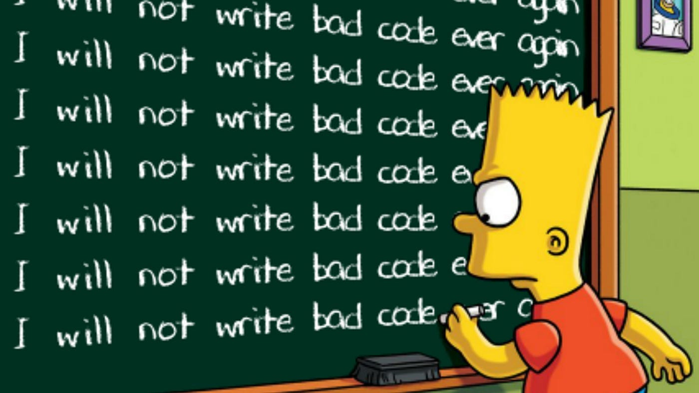

   

<h1 align="center"> I'm a
   
</h1>

- 🌱 I’m currently learning **Frameworks and Libraries**

- 👯 I’m looking to collaborate on **software development**

- 💬 Talk to me about **Anything you want**

   

<h3 align="center">Languages and Tools:</h3>
<h4 align="left">Programming Languages</h4>

 
   
    
   
   
   

<h4 align="left">Frontend Development</h4>

   
   
   
    
   
   
      
     

<h4 align="left">Backend Development</h4>

    

<h4 align="left">Database</h4>

   
    
   
    

<h4 align="left">Devops</h4>

   
    
    
    
    

<h4 align="left">Backend as a Service(BaaS)</h4>

    

<h4 align="left">Framework</h4>

   

<h4 align="left">Testing</h4>

   

<h4 align="left">Software</h4>

    
     
    

<h4 align="left">Static Site Generators</h4>

    

<h4 align="left">Game Engines</h4>

    

<h4 align="left">Other</h4>

   
     

   

<h1 align="center">
   
</h1>

<!-- 

  
  

 -->

   

   

